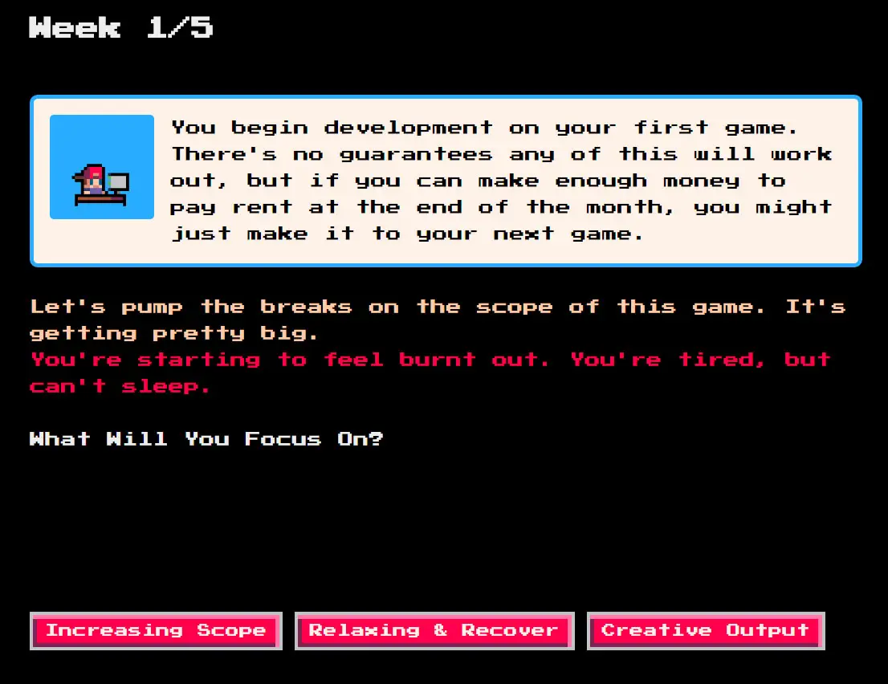

# Creating Interactive Fiction

## 1

There are many way to create interactive fiction. RenPy is one of the more popular tools.

## 2

> Another one is twine.

## 3

 

### Tutorial



#### Specifically This part



🏁

---
