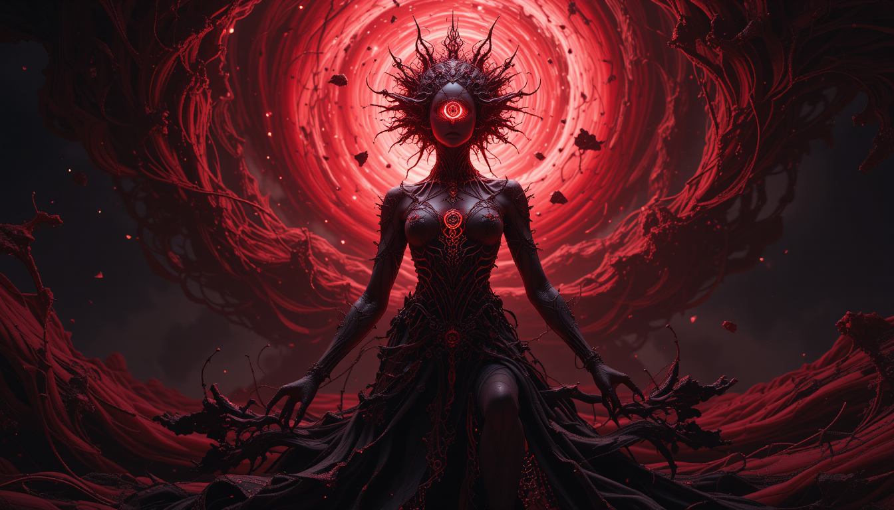
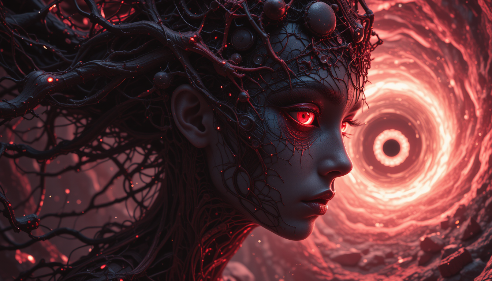
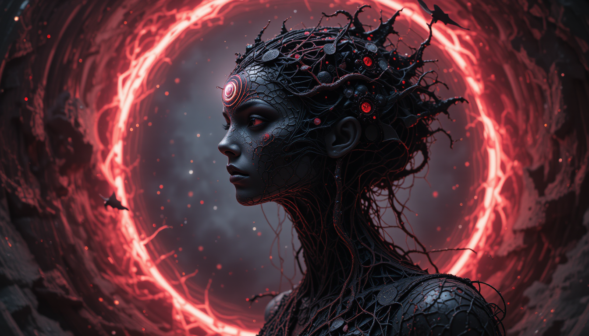
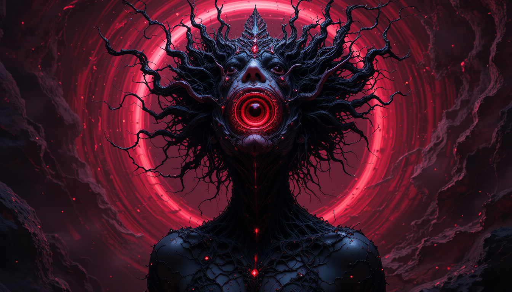

# Cosmic Necronomicon

> Emanating from the event horizon of a collapsing crimson nebula, a siren of the void, sculpted from solidified whispers of forgotten desires. Her form, a fractal tapestry of obsidian lace and molten ruby sinews, pulses with the rhythm of a dying star. A single, cyclopean eye, a swirling vortex of anti-matter, gazes into the observer's soul, reflecting the infinite expanse of their own hidden longings. This is not a portrait, but a ritual. A summoning. The background is not mere darkness, but the absence of all light, a canvas woven from the threads of un-being, punctuated by the ghost-echoes of shattered realities. Render this in a style that is simultaneously hyper-realistic and utterly impossible, a fusion of Baroque chiaroscuro, cosmic horror, and the hallucinogenic fluidity of a sentient oil slick. Imagine if Zdzisław Beksiński collaborated with H.R. Giger on a fever dream induced by the Necronomicon, viewed through a kaleidoscope crafted from the shards of a black hole. Perspective is warped, distorted, a non-Euclidean nightmare where up is down, inside is out, and the observer is both the subject and the artist. The composition should evoke a visceral reaction, a primal shudder of both terror and irresistible attraction.

