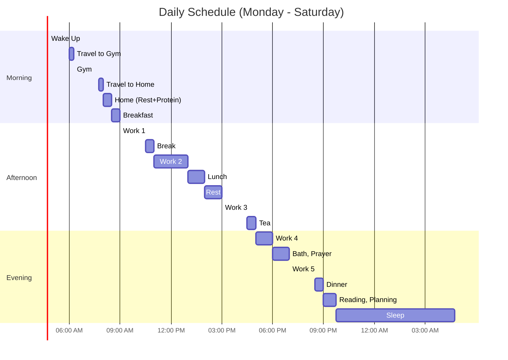

```mermaid
gantt
    dateFormat  HH:mm
    axisFormat %I:%M %p
    title       Daily Schedule (Monday - Saturday)

    section Morning
    Wake Up             :wake, 04:45, 1h15m
    Travel to Gym       :travelGym, 06:00, 15m
    Gym                 :gym, 06:15, 1h30m
    Travel to Home      :travelHome, 07:45, 15m
    Home (Rest+Protein) :homeRest, 08:00, 30m
    Breakfast           :breakfast, 08:30, 30m

    section Afternoon
    Work 1              :work1, 09:00, 1h30m
    Break               :break, 10:30, 30m
    Work 2              :work2, 11:00, 2h
    Lunch               :lunch, 13:00, 1h
    Rest                :rest, 14:00, 1h
    Work 3              :work3, 15:00, 1h30m
    Tea                 :tea, 16:30, 30m

    section Evening
    Work 4              :work4, 17:00, 1h
    Bath, Prayer        :bathPrayer, 18:00, 1h
    Work 5              :work5, 19:00, 1h30m
    Dinner              :dinner, 20:30, 30m
    Reading, Planning   :readingPlanning, 21:00, 45m
    Sleep               :sleep, 21:45, 7h
```
