# Mermaid Diagrams

I was testing mermaid diagrams. Mermaid diagrams are awesome tool to create diagrams. I have created daily schedule using it. In Realtime it will mark current time with it.

<!--more-->

From now, I will be using Mermaid diagrams to do my graphical explanations.

```mermaid
gantt
    dateFormat  HH:mm:ss
    axisFormat %I:%M %p
    title       Daily Schedule (Monday - Saturday)

    section Morning
    Wake Up ☀️            :wake, 04:45:00, 75m
    Goto Gym 🛵       :travelGym, 06:00:00, 15m
    Workout 💪             :gym, 06:15:00, 90m
    Travel to Home 🛵      :travelHome, 07:45:00, 15m
    Rest Home 🏠           :homeRest, 08:00:00, 30m
    Breakfast 🍳           :breakfast, 08:30:00, 30m

    section Afternoon
    Work 🟢 - 1️⃣              :work1, 09:00:00, 90m
    Break ☕               :break, 10:30:00, 30m
    Work 🟢 - 2️⃣              :work2, 11:00:00, 2h
    Lunch 🍴               :lunch, 13:00:00, 1h
    Rest 😴                :rest, 14:00:00, 1h
    Work 🟢 - 3️⃣              :work3, 15:00:00, 90m
    Tea 🍵                 :tea, 16:30:00, 30m

    section Evening
    Work 🟢 - 4️⃣              :work4, 17:00:00, 1h
    Bath, Prayer 🛁🙏        :bathPrayer, 18:00:00, 1h
    Work 🟢 - 5️⃣              :work5, 19:00:00, 90m
    Dinner 🍽️              :dinner, 20:30:00, 30m
    Reading, Planning 📚📅   :readingPlanning, 21:00:00, 45m
    Sleep 🛌               :sleep, 21:45:00, 7h
```

