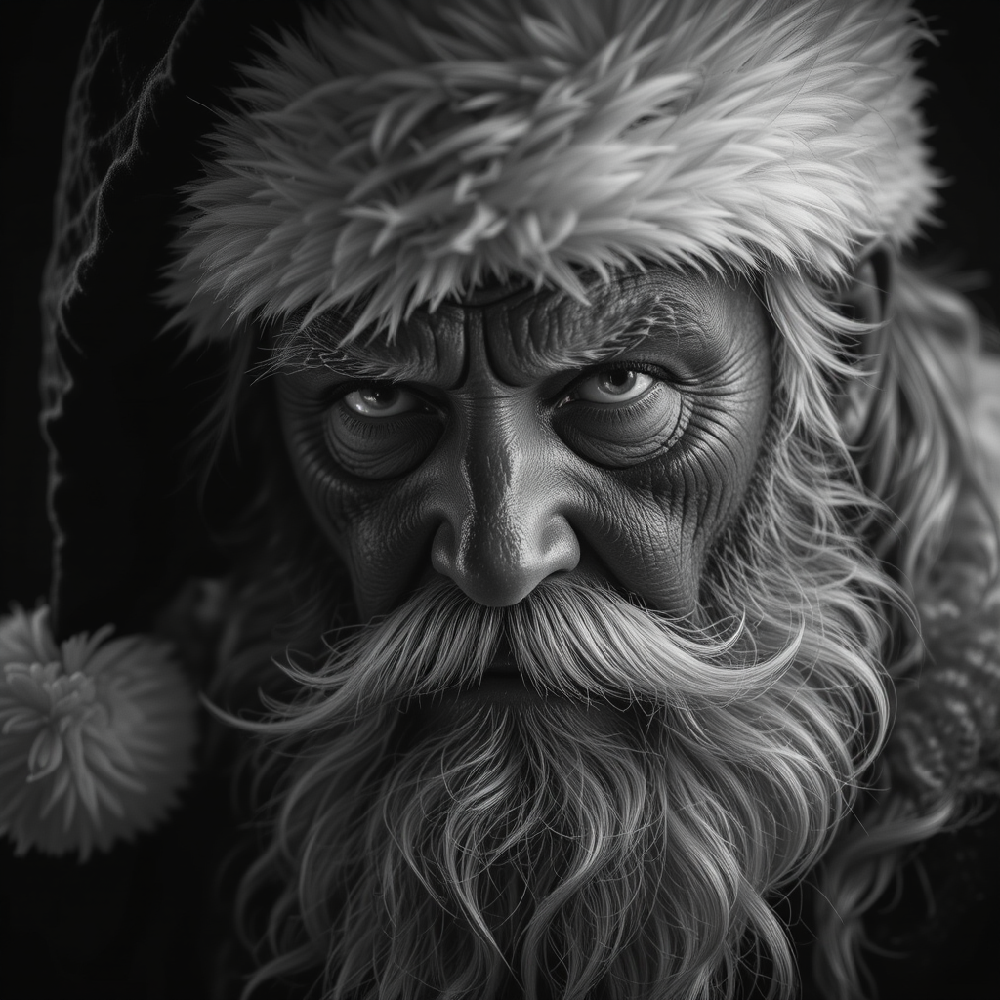
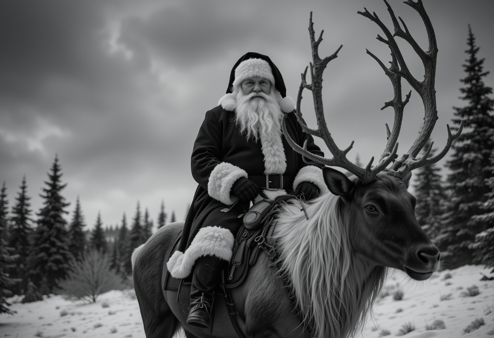

# Santa 

> *A high-contrast black-and-white close-up photo of Santa Claus, showcasing intricate details and a neutral expression as he stares directly into the camera. Half of his face is dramatically shrouded in deep, dark shadows, creating an intense noir aesthetic. His eyes are slightly glowing, adding a hint of surrealism to the hyper-realistic portrayal. Santa's iconic cap is perched on his head, but strands of his hair cascade out, framing his weathered, aged face. Subtle bruises and marks of age add character and depth to his visage. The ultra-close-up composition emphasizes every wrinkle and texture, while the high-contrast lighting enhances the dramatic and mysterious atmosphere. The artists' initials "MD" are signed at the bottom left in small cursive comic-sans font.*

>*A high-contrast black-and-white medium-long shot of Santa Claus, sitting atop a majestic reindeer, exuding a serious neutral expression as he gazes directly into the camera. The scene is steeped in a dramatic, noir-inspired atmosphere. Santa's iconic cap is firmly in place, with strands of his hair gently falling out, adding to his rugged, weathered appearance. The beastly reindeer, with its powerful full antlers and muscular form, stands proudly. The background is a stark, snow-covered landscape, with towering evergreens and a distant, moody overcast sky. The high-contrast lighting casts deep, dark shadows, emphasizing the textures and details of the scene. Santa's expression add a touch of mystique, while the overall composition captures the essence of a timeless, enchanting moment. Cinematic shot, dramatic lighting, sharp image, *