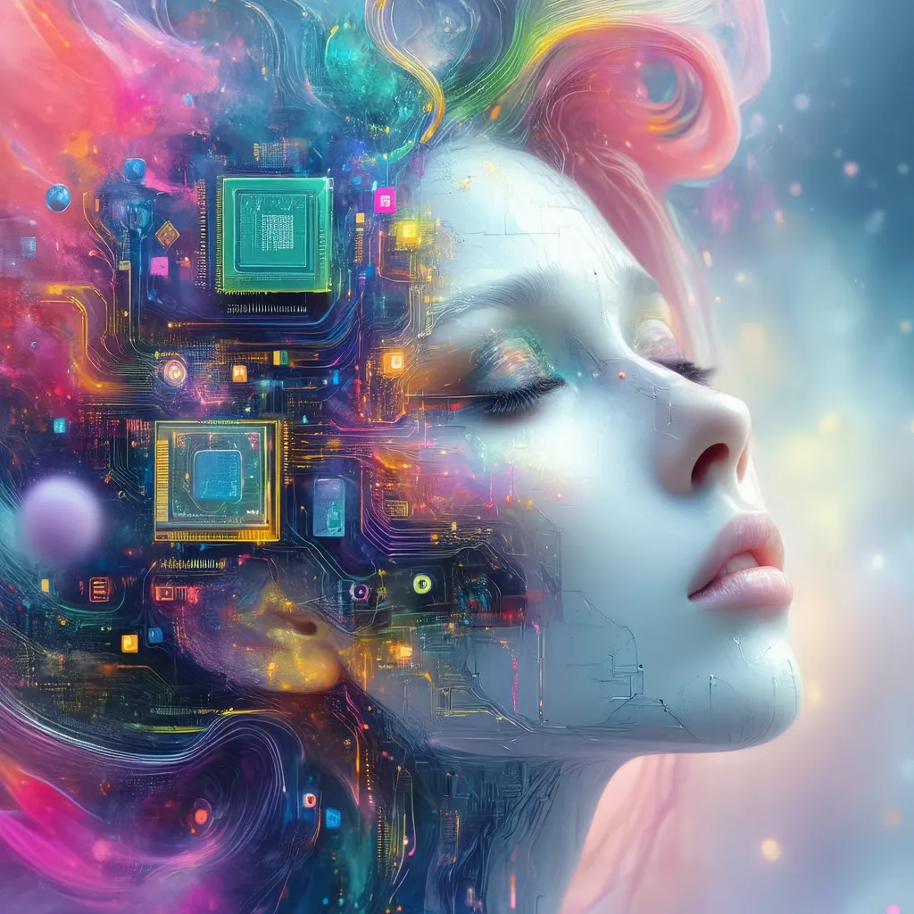

# About Me

## About Me

Hi, I’m **Maddy Meraki** — also known as ***Musing Maddy***.

I build at the intersection of art, technology, and imagination.

<!--more-->

Through digital art, storytelling, and game development, I explore systems of thought, altered perspectives, and the strange edges of reality.

This space is a living archive of those explorations.

> **Mission:** Inspiring new perspectives through creativity and AI.

---
## Interests
### What My Work Explores

- **Mind & Consciousness**: philosophy and psychology as tools to examine identity, perception, and the limits of self-understanding.
- **The Unusual & Enigmatic**: magical realism and mystery that destabilize ordinary assumptions about reality.
- **Art, Technology & Sound**: surreal digital art, systems-driven creativity, immersive trance music, and experimental indie game design.

These themes shape everything I build — from writing to interactive systems. I aim to create work that unsettles, provokes reflection, and expands how we see.

---
## My Projects

### 1. Project Mayaverse — Novel Trilogy

*Project Mayaverse* is a long-form fiction project currently in development.

The first installment, **_The Legend of Jeev Atman_**, begins a trilogy that blends adventure with philosophical inquiry. The narrative examines identity, agency, metaphysics, and psychological transformation through character-driven storytelling.

This is an ongoing writing project, developed iteratively.

### 2. Project Mayaverse — Story-Driven Action RPG

Parallel to the novels, I’m developing a story-focused Action RPG set in the same universe.

Built in Unity, the game translates the trilogy’s themes into interactive systems — allowing players to explore its world through mechanics, choice, and progression rather than exposition alone.

This project treats narrative and gameplay as inseparable design elements.

### 3. Digital Art Collection

An evolving body of digital art exploring thematic contrasts — beauty and distortion, symbolism and abstraction, order and chaos.

The collection grows alongside my other projects, functioning as both experimentation and world-building.

### 4. Musings & Reflections

On **MusingMaddy**, I write personal reflections on philosophy, life, politics, technology, games, and culture.

It’s a casual but thoughtful space — a record of ideas in progress rather than finished conclusions.

---
## Contact
### **Follow**

- Website : &nbsp;
- https://musingmaddy.github.io
  
- X / Twitter : &nbsp;
- https://x.com/musingmaddy

- Youtube : &nbsp;
- https://www.youtube.com/@musingmaddy

### **Contact**

- Email : &nbsp;
- [musingmaddy@gmail.com](mailto:musingmaddy@gmail.com)

---

