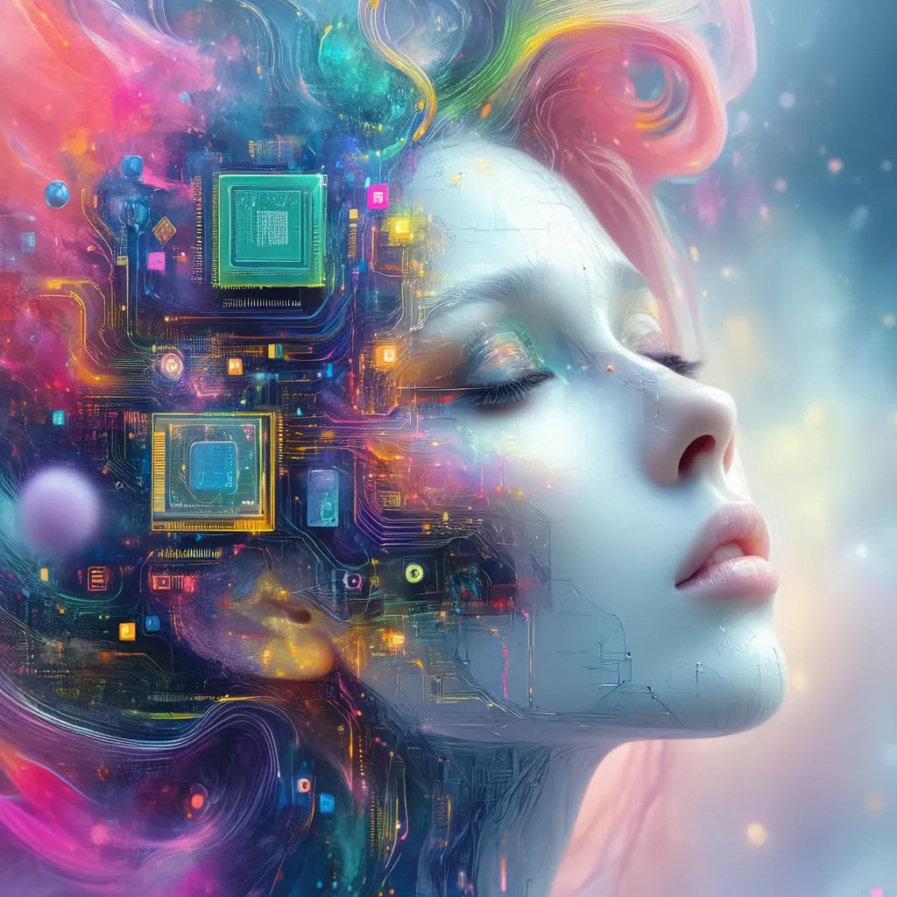

# **About Me**

**Hi there! 👋🏻**, 

Welcome to **MusingMaddy**, a creative space where art, technology, and imagination converge.

<!--more-->

I'm **Maddy Meraki**, an artist, storyteller, and a developer. I'm passionate about harnessing the power of technology to bring creative visions to life. Here, you'll find a curated collection of my digital art, creative projects, and crafty innovations.

I'm always exploring new ways to inspire new perspectives. My work explores the intersection of art and technology, inspiring new ways of thinking and creating.

> **MusingMaddy : “Inspiring New Perspectives Through Creativity & AI”** 

---
## **Interests**

### **What My Work Explores**

- **Mind & Soul:** philosophy, psychology, and human transcendence to understand the deeper facets of human experience.
- **The Unusual & Enigmatic:** magical realism, mystery, and ideas that challenge conventional viewpoints.
- **Art, Tech & Music:** surreal art, immersive trance music, and the creativity of indie gaming.

My projects are infused with these themes, guiding my approach to my digital art, writing, and more. My goal is to create work that sparks insight and invites fresh perspectives. 

---
## **My Projects**

1. **AI Art Collection**

   My Art Project is a vibrant collection of thematic digital artworks. I update this gallery regularly, showcasing the unexpected beauty, horror and uniqueness of thematic art that challenge and inspire viewers to see the world differently.

2. **Fiction Novel: *The Legend Of Jeev Atman***  

   *The Legend Of Jeev Atman* is an upcoming adventure novel in progress that weaves elements of mystery, philosophy, and spiritual growth. Through its characters and storyline, this work explores the questions about life, identity, self discovery and human transcendence. Writing this fiction novel is an ongoing journey, blending storytelling with themes that resonate deeply with my creative vision.

3. **Indie Game Development**  

	Extending the world of *The Legend Of Jeev Atman* into an interactive experience, this indie game project is designed to immerse players in the novel’s universe through artful gameplay and storytelling. Developed in Unity, the game reflects my vision of blending art, narrative, and interaction, offering a fresh, experiential journey where players actively engage with philosophical and creative themes.

4. **My Articles and Logs**

	 In [MusingMaddy](https://musingmaddy.github.io/) website, I casually muse on the questions surrounding the Truth and the essence of existence. Here, I explore my ideas and insights, aiming to inspire contemplation and a greater understanding of life and beyond.

### My Art Collections

- Follow me on [CitvitAI](https://civitai.com/user/musingmaddy/images) & [Piclumen](https://piclumen.com/app/user/social-home/1869048378567086081).

- https://civitai.com/user/musingmaddy/images
- https://piclumen.com/app/user/social-home/1869048378567086081

---
## **License**  

All images, artworks, and written content on *Musing Maddy* are crafted to inspire and are protected under a Creative Commons **CC BY-NC-SA** license. You are welcome to view, share, and use this content for non-commercial purposes, provided that you credit *Musing Maddy®* and link back to this website. This license ensures that your adaptations or remixes of the content must also carry the same terms. For anything else, you can contact me on musingmaddy@gmail.com .

*Note: Some artworks on this site may feature disturbing, surreal or intense imagery that could evoke strong emotional responses. Viewer discretion is advised.*

---

## **Connect With Me**

**Let’s Connect!**

Want to chat about art, tech, or my projects?

- **Personal Email:** [musingmaddy@gmail.com](mailto:musingmaddy@gmail.com)
- **Instagram:** https://instagram.com/musingmaddy